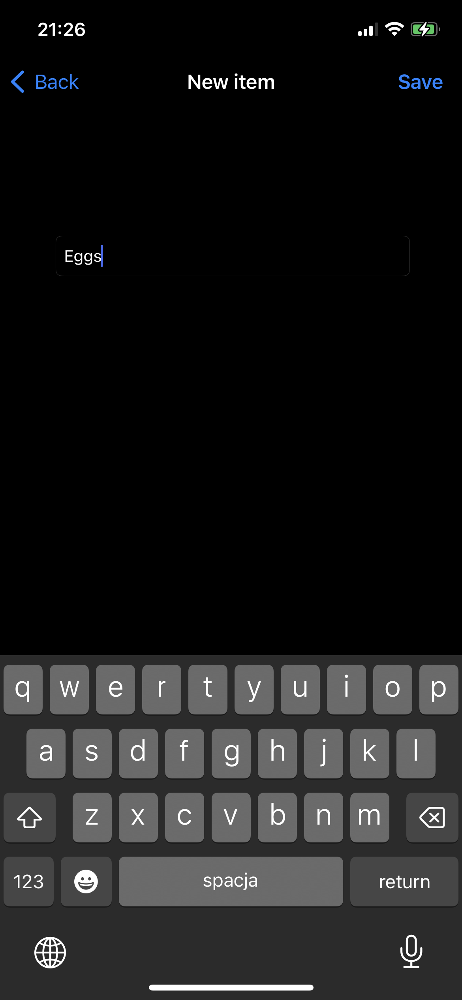
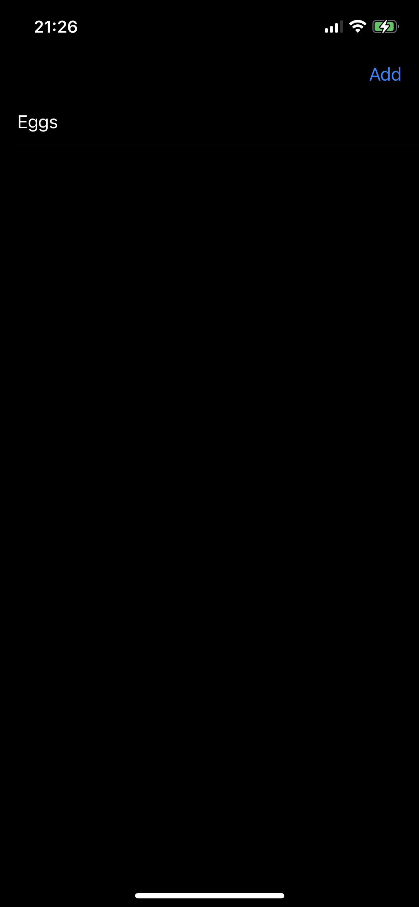
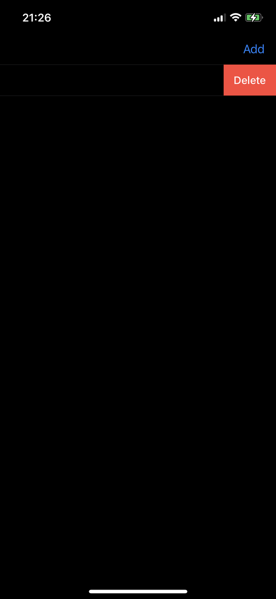

# Swift Grocery List App

Welcome to the Swift Grocery List App! This iOS application allows you to create a grocery list by adding items that will be displayed in a table view. You can also delete items from the list as needed.

## Features

- Add grocery items: You can add items to your grocery list by typing their names into the provided text field and tapping the "Add" button.
- Display grocery list: The added grocery items will be displayed in a table view, showing the item names.
- Delete items: You can remove items from the list by swiping left on an item and tapping the "Delete" button.

## Requirements

- iOS 13.0+
- Xcode 11.0+
- Swift 5.0

## Getting Started

To get started with the Swift Grocery List App, follow these steps:

1. Clone the repository or download the source code.
2. Open the project in Xcode.
3. Build and run the app on an iOS simulator or device.

## Usage

1. Launch the app on your iOS device.
2. You will be presented with the main screen of the app.
3. Tap the "Add" button to add the item to your grocery list.
4. The item will appear in the table view on the screen.
5. To delete an item, swipe left on the item in the table view.
6. Tap the "Delete" button that appears to remove the item from the list.

## Screenshots

## Contributing

Contributions to the Swift Grocery List App are welcome! If you have any suggestions, bug fixes, or improvements, please submit a pull request. For major changes, please open an issue first to discuss the proposed changes.

## License

The Swift Grocery List App is released under the [MIT License](LICENSE). Feel free to use and modify the code according to the terms of the license.
